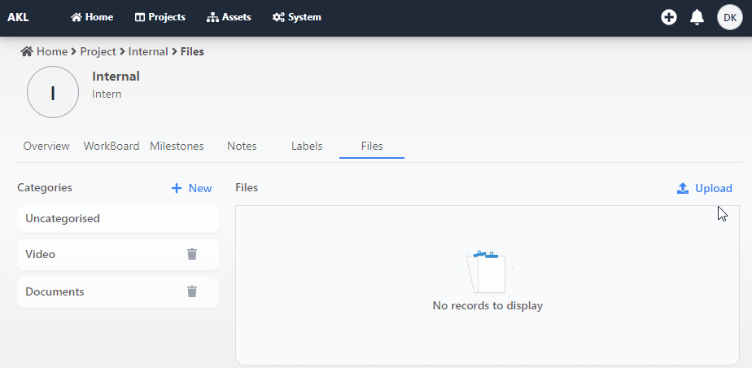
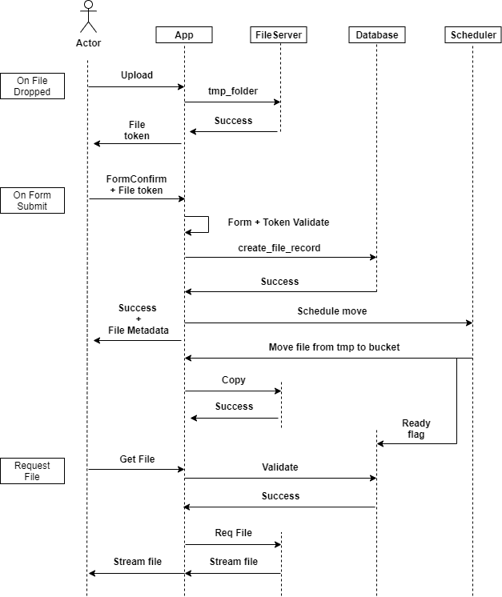

<!-- PROJECT LOGO -->
<br />
<p align="center">
  <a href="https://github.com/damikun/React-File-DragDrop">
  
  </a>

  <h3 align="center">File Drag-Drop</h3>

  <p align="center">
   Preview of drag drop react component
  </p>
</p>


<!-- ABOUT -->
## About

<p align="center">
  <a href="https://github.com/damikun/React-File-DragDrop">
    
  </a>
  
  <p align="center">
   Internal project file upload process
  </p>
</p>

The image describe simplified version of file upload handling for custom system...

This componnent helps to push file over API to backend to get tmp file token which is used to push file using form...

### Built With

This section should list any major frameworks that you built your project using. Leave any add-ons/plugins for the acknowledgements section. Here are a few examples.
* [Bootstrap](https://getbootstrap.com)
* [JQuery](https://jquery.com)
* [Laravel](https://laravel.com)


<!-- GETTING STARTED -->

### Prerequisites

This is an example of how build and run preview.. You shoud customised this componnet by yourself..

* npm
  ```sh
  npm install npm@latest -g
  ```

### Installation

1. Get a free API Key at [https://example.com](https://example.com)
2. Clone the repo
   ```sh
   git clone https://github.com/your_username_/Project-Name.git
   ```
3. Install NPM packages
   ```sh
   npm install
   ```
4. Enter your API in `config.js`
   ```JS
   const API_KEY = 'ENTER YOUR API';
   ```


<!-- USAGE EXAMPLES -->
## Usage


